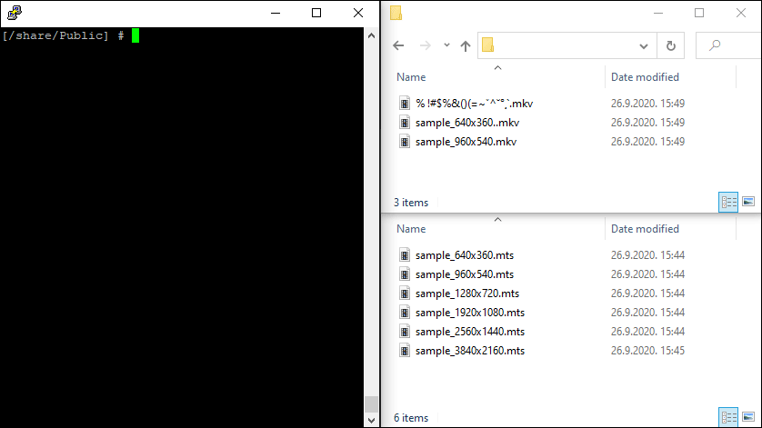

<p align="center">
  <h1>
    mp4c
  </h1>
</p>

Bash script for converting your entire video collection to mp4.

<p align="center">
  
</p>

## Table of Contents

- [About](#about)
- [Features](#features)
- [Usage](#usage)
- [Requirements](#requirements)
- [Acknowledgments](#acknowledgments)
- [FAQ](#faq)

## About <a name="about"></a>

Easy to use conversion script for folders. Safely convert your video files to mp4, use various options ([ffmpeg 4.3+](https://ffmpeg.org/ffmpeg.html)) and track everything with verbose log file.

Although it's mainly tested with NAS devices like QNAP and Synology, you should be able to use it on any system that has Bash. Hack it apart, change whatever you feel fit to suit your needs.

## Features <a name="features"></a>

- **Commands**
  - scan - Find how many video files you have before doing any processing.
  - convert - Convert your video files to mp4.
  - convert-replace - Override converted files with new options.
  - revert - Get back original files from backups.
  - cleanup - Clean mp4 file names and remove backups.
- **Safety first** - Backup original video files before conversion.
- **Multiple formats** - Convert video files with different formats in one go.
- **Conversion presets** - Use conversion presets or your custom ffmpeg options.
- **Original metadata** - Converted videos will have preserved aspect ratio and original date/time.
- **Relative folders** - Supports relative folder paths.
- **Nested folders** - Will include nested folders to process video files.
- **Excluded folders** - Excludes known QNAP and Synology trash/temp folders.
- **Logs** - Track each command and all results/errors in log file. Data is in clean readable format, also ready for post-processing.
- **User options** (section within script)
  - ffmpegPath - Change path if ffmpeg has different location. By default mp4c will try to use default path of ffmpeg and of NAS packages.
  - backupExtension - If you don't like extension name for backups, change it.
  - excludedFolders - Need to exclude additional folder, add them here.
  - logActivated - Don't need the logs, turn it off.
  - logPath - Would like to keep logs in specific place, set path here. Default is same folder as `mp4c.sh`.

## Usage <a name="usage"></a>

To use script enter mp4c path and run it with required/optional arguments.

> \> sh mp4c<span>.sh</span> [command] [extensions] [*ffmpegOptions] [path]

##### IMPORTANT

You'll need to have ffmpeg 4.3+ installed on your system. Script will try to find ffmpeg path depending on NAS/system. If you have different path, be sure to set it under "user options" inside the script.

If you are using NAS:

- QNAP - [Qnapclub](https://qnapclub.eu)
- Synology - [SynoCommunity](https://synocommunity.com)

### Arguments

<details>
  <summary>[command] - Required argument to scan or process video files.</summary>
  <br />

| Argument                   | Description                                   |
| -------------------------- | --------------------------------------------- |
| <kbd>scan</kbd>            | Find video files                              |
| <kbd>convert</kbd>         | Convert video files to mp4 and create backups |
| <kbd>convert-replace</kbd> | Replace already converted files with new      |
| <kbd>revert</kbd>          | Revert original files (if backups exists)     |
| <kbd>clean</kbd>           | Clean and keep .mp4 files, remove backups     |

 </details>

<details>
    <summary>[extensions] - Required argument that will be used to match video files. Case insensitive and can include ".".</summary>
    <br />

| Argument             | Description                                |
| -------------------- | ------------------------------------------ |
| <kbd>.abc</kbd>      | Match all video files for one format       |
| <kbd>.abc,.xyz</kbd> | Match all video files for multiple formats |

</details>

<details>
    <summary>[*ffmpegOptions] - Optional argument, used ONLY with convert and convert-replace command, defaults to <kbd>copy</kbd>.</summary>
  <br />

| Argument               | Description                                                |
| ---------------------- | ---------------------------------------------------------- |
| <kbd>copy</kbd>        | Preserve video, audio AAC 256 kbps.                        |
| <kbd>1080p</kbd>       | Resize video to 1080p, audio AAC 256 kbps.                 |
| <kbd>1080p-const</kbd> | Resize video (constant rate) to 1080p, audio AAC 256 kbps. |
| <kbd>720p</kbd>        | Resize video to 720p, audio AAC 192 kbps.                  |
| <kbd>720p-const</kbd>  | Resize video (constant rate) to 720p, audio AAC 192 kbps   |
| <kbd>480p</kbd>        | Resize video to 480p, audio AAC 128 kbps                   |
| <kbd>480p-const</kbd>  | Resize video (constant rate) to 480p, audio AAC 128 kbps   |
| <kbd>360p</kbd>        | Resize video to 360p, audio AAC 128 kbps                   |
| <kbd>360p-const</kbd>  | Resize video (constant rate) to 360p, audio AAC 128 kbps   |
| <kbd>custom</kbd>      | Use your own ffmpeg options. Ex. "-vf scale=320:240"       |

</details>

<details>
    <summary>[path] - Optional argument, defaults to current directory. Can be relative path.</summary>
  <br />

| Argument                              | Description                                        |
| ------------------------------------- | -------------------------------------------------- |
| <kbd>./abc</kbd> or <kbd>"/abc"</kbd> | Ex. ./Folder or ../Folder or "/Folder/SubFolder 2" |

</details>

### Log

Log file is by default created in same folder as `mp4c.sh`. Every command will add new record. It is meant to be fail-safe mechanism to trace back your actions in case anything goes unexpected. Each command record is separated with `#` character, and apart from processed files, has same amount of "metadata" lines. If some error occurs at anytime of processing, it will be shown at end of each line starting with `|ERROR` tag.

Example of log record:

```
#
DATE 2021-03-06_22:25:34__2021-03-06_22:25:35
STATUS success
COMMAND convert
EXTENSIONS mts
OPTIONS copy
FOLDER /share/CACHEDEV1_DATA/Public
FILES 6
/share/CACHEDEV1_DATA/Public/videos-mts/sample_640x360.mts
/share/CACHEDEV1_DATA/Public/videos-mts/sample_960x540.mts
/share/CACHEDEV1_DATA/Public/videos-mts/sample_2560x1440.mts
/share/CACHEDEV1_DATA/Public/videos-mts/sample_1280x720.mts
/share/CACHEDEV1_DATA/Public/videos-mts/sample_1920x1080.mts
/share/CACHEDEV1_DATA/Public/videos-mts/sample_3840x2160.mts
```

## Requirements <a name="requirements"></a>

- Bash 3.2+
- ffmpeg 4.3+

## Acknowledgments <a name="acknowledgments"></a>

- **dvlden** - [ffmpeg options](https://gist.github.com/dvlden/b9d923cb31775f92fa54eb8c39ccd5a9), presets used for constant video rates.
- Bash scripting community

## FAQ <a name="faq"></a>

- **Can I use mp4c professionally in my company?**  
  Yes. You are free to use mp4c in your company or home as you wish, it is released under [MIT](./LICENSE) license.
- **My folder is not being found, but it exists. Is this an error?**  
  No. If your folder name includes `$` or spaces be sure to wrap it with quotation marks.
  > sh mp4c<span>.sh</span> scan mts "./abc$/x y z"
- **I can't seem to process folder. Is this an error?**  
  No. You need to have read/edit rights for folders to process them.

## License

The MIT License ([MIT](./LICENSE))  
Copyright (c) 2021 Marin Muštra

_In loving memory of Johnny._
